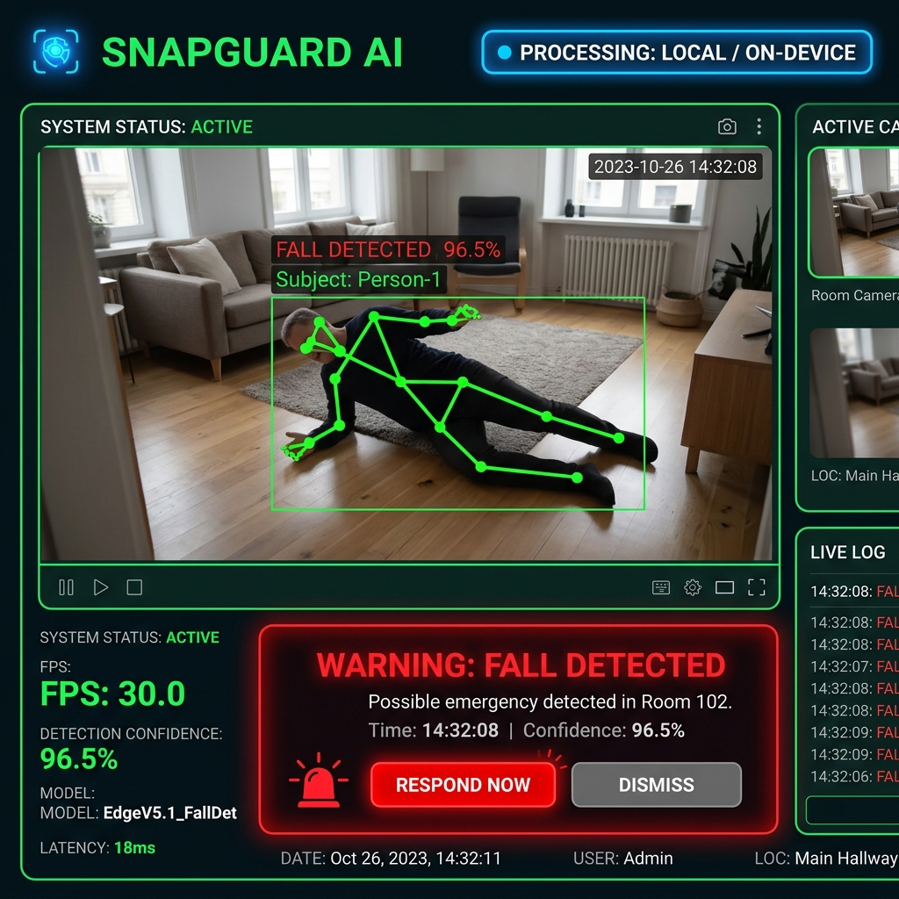

# SnapGuard AI – Intelligent On-Device Safety Detection



> **SAFETY NOTICE**: This prototype is intended for demonstration and research purposes only. It is not a medical device and should not be relied upon as the sole method for detecting emergencies.

---

## 1. Project Title
**SnapGuard AI – Intelligent On-Device Safety Detection**

---

## 2. Project Overview
**SnapGuard AI** is a real-time, privacy-preserving Edge AI computer-vision application designed to detect human falls directly from a standard webcam stream. By executing all pose estimation and temporal spatial calculations locally on the user's device, SnapGuard AI delivers instantaneous emergency alerts without streaming video or personal data to the cloud.

---

## 3. Problem Statement
Falls are a leading cause of accidental injury and mortality among seniors and solitary workers. Traditional emergency response buttons often fail when an individual is rendered unconscious or unable to reach their device. Existing cloud-connected smart camera solutions pose severe privacy risks and suffer from network latency and internet outage vulnerabilities.

---

## 4. Proposed Solution
SnapGuard AI provides an **on-device computer vision safety monitoring solution**. By leveraging real-time 3D pose landmark detection combined with a temporal state-machine fall algorithm, SnapGuard AI automatically detects rapid downward drops and horizontal posture transitions. Upon detecting a fall, it triggers immediate local visual and audio emergency warnings.

---

## 5. Key Features
- 🎥 **Live Camera Processing**: Continuous frame analysis from built-in webcams or USB cameras.
- 🦴 **Pose Landmark Tracking**: 33 keypoint human pose tracking powered by MediaPipe Pose.
- 📐 **Spatial Orientation Analysis**: Real-time computation of torso inclination angle, hip vertical height, and body aspect ratio.
- ⏱️ **Multi-Frame Temporal Fall Detection**: State machine algorithm that requires consecutive abnormal posture frames before triggering alerts, eliminating single-frame false positives.
- 🚨 **Emergency Visual & Audio HUD**: High-contrast modern Heads-Up Display showing real-time status (`SAFE` vs `WARNING: FALL DETECTED`), confidence %, and detection timestamps (`Time: HH:MM:SS`).
- 🔔 **Alert Cooldown System**: Intelligent audio alert throttling prevents continuous sound looping.
- 💻 **Synthetic Simulation Mode**: Built-in test feed mode allowing complete app execution and visual verification on machines without camera hardware.
- ⚡ **Lightweight Architecture**: Designed for minimal CPU overhead and easy export to ONNX / Snapdragon NPU runtimes.

---

## 6. How It Works
1. **Frame Capture**: OpenCV captures video frames continuously from the system webcam.
2. **Landmark Extraction**: MediaPipe Pose locates key body joints (Nose, Shoulders, Hips, Knees, Ankles).
3. **Metric Computation**: The system calculates the torso angle relative to horizontal ground and tracks the vertical velocity of the hips ($y_{\text{hip}}$).
4. **Temporal Verification**: A sliding history buffer evaluates posture stability across 15–30 consecutive frames.
5. **Fall Trigger**: When a rapid downward drop coincides with a horizontal torso ($< 40^\circ$) and remains low for 5+ frames, status transitions to `FALL_DETECTED`.
6. **Alert Dispatch**: Audio chime plays, visual alert box flashes, and timestamp is logged.

---

## 7. Architecture
```
                                 [ Camera Feed ]
                                        │
                                        ▼
                             [ OpenCV Frame Stream ]
                                        │
                                        ▼
                           [ MediaPipe Pose Processor ]
                                        │
                         (33 Keypoints / Landmarks)
                                        │
                                        ▼
                           [ Stateful Fall Detector ]
                    (Torso Angle + Hip Y + Drop Velocity)
                                        │
                                        ▼
                            [ Alert & HUD Manager ]
                     ┌──────────────────┴──────────────────┐
                     ▼                                     ▼
             [ Visual HUD Overlay ]                [ Audio Notification ]
           (SAFE / FALL DETECTED)                  (Non-blocking Chime)
```

See [docs/architecture.md](docs/architecture.md) for full mathematical and pipeline details.

---

## 8. Technology Stack
- **Programming Language**: Python 3.11+
- **Computer Vision**: OpenCV (`opencv-python`)
- **Pose Estimation**: MediaPipe Pose
- **Numerical Computing**: NumPy
- **User Interface**: OpenCV HighGUI (and Streamlit compatibility)
- **Version Control**: Git / GitHub

---

## 9. Installation

Clone the repository and set up a virtual environment:

```bash
# Clone repository
git clone https://github.com/your-username/snapguard-ai.git
cd snapguard-ai

# Create virtual environment
python3 -m venv .venv

# Activate virtual environment
source .venv/bin/activate

# Install dependencies
pip install -r requirements.txt
```

---

## 10. How to Run

### Standard Webcam Mode
Launch the application with live camera monitoring:

```bash
python app.py
```

### Synthetic Simulation Mode (No Camera Required)
Test the full application pipeline with a simulated animated falling subject:

```bash
python app.py --synthetic
```

### CLI Command Options
```text
options:
  --camera-id CAMERA_ID  Webcam device camera ID index (default: 0)
  --width WIDTH          Webcam frame width (default: 1280)
  --height HEIGHT        Webcam frame height (default: 720)
  --confirmation-frames  Consecutive abnormal frames to confirm fall (default: 5)
  --angle-threshold      Torso horizontal angle threshold in degrees (default: 40.0)
  --cooldown COOLDOWN    Alert audio cooldown in seconds (default: 5.0)
  --synthetic            Run with simulated synthetic webcam feed
  --no-sound             Disable alert audio sound playback
```

### Hotkey Controls
- `q` or `ESC`: Quit application
- `r`: Reset fall state and clear alerts
- `d`: Toggle debug telemetry metrics overlay

---

## 11. Example Output

When running, SnapGuard AI renders a live HUD over the webcam stream:

```text
+-------------------------------------------------------------------+
|  SNAPGUARD AI                         PROCESSING: LOCAL / ON-DEVICE |
+-------------------------------------------------------------------+
| FPS: 30.0                                                         |
| Confidence: 96.5%                                                 |
|                                                                   |
|                   [ Person Pose Skeleton ]                        |
|                                                                   |
| +---------------------------------------------------------------+ |
| | WARNING: FALL DETECTED                                        | |
| | Possible emergency detected.                                  | |
| | Time: 14:32:08                                                | |
| +---------------------------------------------------------------+ |
+-------------------------------------------------------------------+
```

---

## 12. Limitations
- **Occlusion**: Fall detection accuracy decreases if key torso joints (shoulders/hips) are obstructed by furniture.
- **Lighting Conditions**: Extremely dark environments reduce camera input quality and landmark tracking fidelity.
- **Camera Position**: Optimal detection occurs when the camera has a clear side or angled view of the room.

---

## 13. Future Improvements
- 🔄 **Multi-Person Tracking**: Expand state machine to track multiple subjects independently within the frame.
- 📱 **SMS / Webhook Dispatch**: Integrate Twilio / WhatsApp API to send remote emergency notifications to caregivers.
- 🧠 **Custom Deep Learning Classifier**: Train a custom LSTM / Spatial-Temporal Graph Convolutional Network (ST-GCN) model on public fall datasets.

---

## 14. Snapdragon / Edge AI Deployment Direction

> **Note**: This prototype currently performs local computer-vision inference on the development machine.

To transition SnapGuard AI to Qualcomm Snapdragon AI hardware (e.g. Snapdragon X Elite, Snapdragon 8 Gen series, or Qualcomm QCS industrial processors), the deployment pipeline is structured as follows:

```
Camera
  ↓
Preprocessing
  ↓
Optimized AI Model (ONNX / TFLite FP16/INT8)
  ↓
Snapdragon AI Runtime / Qualcomm AI software stack (QNN SDK / SNPE)
  ↓
Snapdragon hardware (Hexagon NPU / Adreno GPU)
  ↓
Local inference (< 5ms latency)
  ↓
Emergency alert
```

---

## 15. License

Distributed under the MIT License. See `LICENSE` for more information.
