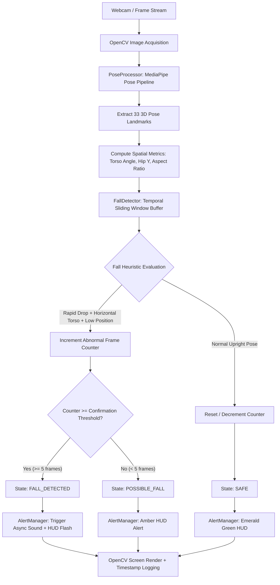

# SnapGuard AI – Architecture & System Design

## Overview

**SnapGuard AI** is a lightweight, privacy-focused computer vision safety application designed to process video streams locally on-device. It analyzes human pose keypoints frame-by-frame to identify falls and emergencies in real-time, executing without external cloud dependencies.

---

## System Architecture Pipeline



---

## Detailed Component Specifications

### 1. `PoseProcessor` (`src/pose_processor.py`)
- **Engine**: MediaPipe Pose (`model_complexity=1`).
- **Core Responsibilities**:
  - Convert BGR frames to RGB for MediaPipe inference.
  - Extract key anatomical landmarks: `NOSE`, `LEFT_SHOULDER`, `RIGHT_SHOULDER`, `LEFT_HIP`, `RIGHT_HIP`, `LEFT_KNEE`, `RIGHT_KNEE`, `LEFT_ANKLE`, `RIGHT_ANKLE`.
  - Calculate key spatial parameters:
    $$\text{Mid-Shoulder} = \left(\frac{x_{\text{L.Sh}} + x_{\text{R.Sh}}}{2}, \frac{y_{\text{L.Sh}} + y_{\text{R.Sh}}}{2}\right)$$
    $$\text{Mid-Hip} = \left(\frac{x_{\text{L.Hip}} + x_{\text{R.Hip}}}{2}, \frac{y_{\text{L.Hip}} + y_{\text{R.Hip}}}{2}\right)$$
    $$\theta_{\text{torso}} = \arctan2(|y_{\text{hip}} - y_{\text{shoulder}}|, |x_{\text{shoulder}} - x_{\text{hip}}|) \times \frac{180}{\pi}$$
  - **Torso Angle**: $\theta_{\text{torso}} \approx 90^\circ$ when standing upright, drops below $40^\circ$ when horizontal.

---

### 2. `FallDetector` (`src/fall_detector.py`)
- **State Machine**:
  - `SAFE`: Subject upright, moving normally.
  - `POSSIBLE_FALL`: Transient horizontal posture or sudden downward movement detected.
  - `FALL_DETECTED`: Fall confirmed by persistent horizontal pose over consecutive frames ($K \ge 5$).
- **Detection Heuristics**:
  1. **Torso Angle Threshold**: $\theta_{\text{torso}} < 40.0^\circ$
  2. **Hip Height Threshold**: $y_{\text{hip}} > 0.60$ (in normalized frame coordinates where $0.0$ is top and $1.0$ is floor).
  3. **Velocity / Rapid Drop**: $\Delta y_{\text{hip}} = y_{\text{hip}}(t) - \min_{t-15 \le \tau < t} y_{\text{hip}}(\tau) > 0.12$.
  4. **Aspect Ratio**: Bounding box width-to-height ratio $> 1.0$.

- **Temporal Filtering & Persistence**:
  Single-frame spikes (e.g. tying shoes or bending over briefly) are filtered out by requiring $K$ consecutive abnormal frames before triggering `FALL_DETECTED`.

---

### 3. `AlertManager` (`src/alert.py`)
- **HUD Telemetry Overlay**:
  - Header Banner: `SNAPGUARD AI` + `PROCESSING: LOCAL / ON-DEVICE`.
  - Telemetry Card: Live FPS, Detection Confidence %.
  - Emergency Alert Card: Pulsating banner with timestamp `Time: HH:MM:SS`.
- **Audio Dispatcher**:
  - Non-blocking daemon thread executes native system audio alerts (`afplay` on macOS, system beep on Linux/Windows).
  - Cooldown timer (5 seconds default) prevents audio spamming on continuous fall frames.

---

## Edge AI & Qualcomm Snapdragon Deployment Direction

To transition SnapGuard AI from desktop CPU/GPU prototype to ultra-low-power Edge AI hardware (e.g., Qualcomm Snapdragon 8-series or Snapdragon X Elite NPU):

```
Camera Sensor Input
       │
       ▼
OpenCV / Hardware Image Processing Engine (ISP)
       │
       ▼
Model Quantization & Optimization (INT8 / FP16)
  • Export MediaPipe / Custom Pose Model to ONNX format
  • Quantize weights with Qualcomm AI Hub / Qualcomm Neural Processing SDK
       │
       ▼
Qualcomm AI Engine Direct SDK / QNN Runtime
  • Target Hexagon NPU / Adreno GPU acceleration
       │
       ▼
Snapdragon Hardware Execution
       │
       ▼
On-Device Low-Latency Fall Detection Alert (< 5ms inference)
```

### Benefits of Snapdragon Hardware Acceleration:
- **Sub-10ms Latency**: Real-time 60+ FPS pose estimation.
- **Ultra-low Power**: $< 2\text{W}$ consumption, suitable for battery-operated smart home cameras and wearables.
- **Complete Privacy**: Zero camera data leaves the device.
